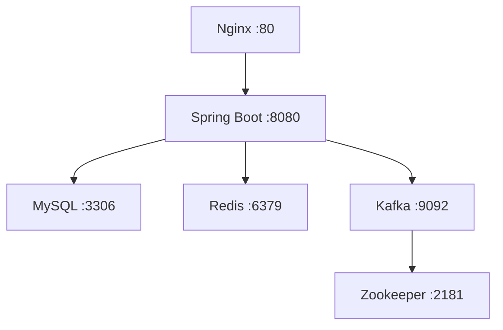

# Deployment Guide

## Prerequisites

- Docker 20.10+
- Docker Compose 2.0+
- Git

## Quick Start

### 1. Clone Repository
```bash
git clone https://github.com/Yasin4261/i-need-courier.git
cd i-need-courier
```

### 2. Environment Setup
The application uses Docker Compose with predefined environment variables. No additional configuration is required for development.

### 3. Start Services
```bash
# Build and start all services
docker-compose up --build -d

# Check service status
docker-compose ps

# View logs
docker-compose logs -f web-app
```

### 4. Access Application
- **Web Interface**: http://localhost
- **API**: http://localhost:8080
- **Health Check**: http://localhost/health

## Service Architecture



## Environment Configuration

### Development
```yaml
# docker-compose.yml
services:
  web-app:
    environment:
      SPRING_PROFILES_ACTIVE: docker
      SPRING_DATASOURCE_URL: jdbc:mysql://mysql:3306/courier_db
      SPRING_REDIS_HOST: redis
      SPRING_KAFKA_BOOTSTRAP_SERVERS: kafka:9092
```

### Production Recommendations

1. **Security**
   - Change default passwords
   - Use environment-specific secrets
   - Enable SSL/TLS

2. **Database**
   - Use external managed MySQL instance
   - Configure backup strategies
   - Optimize connection pooling

3. **Caching**
   - Use Redis cluster for high availability
   - Configure appropriate memory limits

4. **Monitoring**
   - Enable application metrics
   - Configure log aggregation
   - Set up health check monitoring

## Scaling Considerations

### Horizontal Scaling
```yaml
services:
  web-app:
    deploy:
      replicas: 3
    depends_on:
      - mysql
      - redis
```

### Load Balancing
Nginx is configured to handle load balancing across multiple application instances.

## Troubleshooting

### Common Issues

**Database Connection Failed**
```bash
# Check MySQL container
docker-compose logs mysql

# Verify database credentials
docker-compose exec mysql mysql -u courier_user -p courier_db
```

**Application Won't Start**
```bash
# Check application logs
docker-compose logs web-app

# Restart specific service
docker-compose restart web-app
```

**Port Conflicts**
```bash
# Check port usage
netstat -tulpn | grep :80

# Stop conflicting services
sudo service apache2 stop
```

### Health Checks

```bash
# Application health
curl http://localhost/health

# Database connectivity
curl http://localhost:8080/actuator/health

# Service status
docker-compose ps
```

## Backup & Recovery

### Database Backup
```bash
# Create backup
docker-compose exec mysql mysqldump -u courier_user -p courier_db > backup.sql

# Restore backup
docker-compose exec -i mysql mysql -u courier_user -p courier_db < backup.sql
```

### Volume Backup
```bash
# Backup volumes
docker run --rm -v courier_mysql_data:/data -v $(pwd):/backup alpine tar czf /backup/mysql_backup.tar.gz /data
```

## Monitoring

### Application Metrics
- `/actuator/health` - Health status
- `/actuator/metrics` - Performance metrics
- `/actuator/info` - Application information

### Container Monitoring
```bash
# Resource usage
docker stats

# Container logs
docker-compose logs -f [service-name]
```
